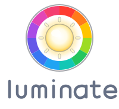

<!-- SPDX-License-Identifier: CC-BY-SA-4.0 -->
<!-- SPDX-FileCopyrightText: 2026 Elizabeth Kiara Regina Ashford -->

<p align="center">
  
</p>

# Luminate

Luminate is an early-stage Linux lighting-control stack. A supervising daemon
keeps desired state and hardware observations, native plugins own hardware
access in isolated child processes, and stable Rust/C clients provide the
consumer API. The CLI is the primary v1 user interface. APIs and configuration
are still pre-release; the plugin ABI is intentionally lockstep and unstable.

## Hardware and platform status

- The demo plugins provide reproducible virtual system, keyboard, bulb, and
  ambient devices for development.
- Alienware keyboard and AW-ELC control paths have been validated on hardware.
- LIFX LAN supports plain-colour bulbs and Z/Beam linear multizone products;
  A19 and BR30 bulbs have been validated, while owned Z and Beam devices remain
  explicitly untested.
- Philips Hue Bridge API v2 support provides authenticated local discovery,
  per-light colour, colour temperature, brightness, emission, and readback.
  Discovery and push-link setup are validated on a BSB002 bridge, with control
  and readback validated on an LCA007 colour lamp. Broader product and network
  scenarios remain experimental.
- Linux LED class supports standard brightness-only and RGB keyboard
  backlights, including zoned keyboards. Other LED-class status indicators are
  hidden by default, and this path is currently validated with fake sysfs
  fixtures rather than physical hardware.
- WLED controllers are discovered over mDNS (or configured explicitly) and
  expose JSON state/readback, segments, colour, brightness, power, and reported
  firmware effects. Realtime pixels remain deferred pending a shared streaming
  design, and physical hardware validation is still outstanding.
- Linux is the supported platform. systemd and OpenRC packaging are present,
  including native Alpine/musl packages.

## Build prerequisites

Install Rust 1.89 or newer, Cargo, a C11 compiler, pkg-config, and the native
dependencies required by `hidapi` (normally libudev development headers on
Linux). Building packages additionally requires the relevant distribution
tools or container runtime.

```sh
cargo build --workspace
cargo test --workspace
```

## Demo quick start

Build the daemon, CLI, and demo plugin, then start the daemon with the supplied
local configuration:

```sh
cargo build -p luminated -p luminate-cli -p luminate-plugin-demo-system
LUMINATED_CONFIG="$PWD/docs/development/config/demo-plugin.local.toml" \
  cargo run -p luminated
```

In another terminal:

```sh
cargo run -p luminate-cli -- list
cargo run -p luminate-cli -- inspect --device demo-keyboard --surface zones
cargo run -p luminate-cli -- set-colour --device demo-keyboard \
  --surface zones --element g1 --rgb '#2878ff'
cargo run -p luminate-cli -- set-effect --device demo-mouse \
  --surface lighting --effect breathe --rgb 'rgb(255, 30, 100)' --period-ms 1500
cargo run -p luminate-cli -- set-colour --collection office --rgb orange
cargo run -p luminate-cli -- all-off
```

Use `luminatectl help` and `luminatectl help <command>` for selector rules and effect
arguments. A collection command applies to the collection's current resolved
members. Add `--reject` when every current member must support it.

Plugins may advertise guided setup workflows. List them for a plugin, then run
one by its ID:

```sh
luminatectl plugin setup PLUGIN
luminatectl plugin setup PLUGIN WORKFLOW
```

Add `--json` for machine-readable discovery and a JSON-lines session interface.

## Persistence and safety

The daemon stores desired overlays, adopted hardware baselines, device location
overrides, and location defaults. Per-device `restore`, `adopt`, and `leave`
policies decide whether startup writes state, reads it into the baseline, or
avoids writes. Unknown hardware state alone never triggers a guessed write.

`luminatectl all-off` (also `init`) is best-effort. It turns off maximal safe,
non-overlapping targets but reports and skips targets whose hardware requires
wear-limited persistent writes. Successful mutations are persisted only after
the hardware update succeeds.

When a dynamic device has been permanently removed, discard the state retained
for a possible reappearance with `luminatectl purge-withdrawn --device ID`. The
daemon rejects active devices; this command never clears live hardware.

## Libraries and further documentation

- [Contributing](CONTRIBUTING.md)
- [Code of Conduct](CODE_OF_CONDUCT.md)
- Rust example: [`crates/libluminate/examples/inspect.rs`](crates/libluminate/examples/inspect.rs)
- [Rust client guide](docs/development/rust-client.md)
- [D-Bus consumer guide](docs/development/dbus.md)
- C example: [`crates/libluminate/examples/topology.c`](crates/libluminate/examples/topology.c)
- M16 R2 keyboard video example:
  [`crates/libluminate/examples/bad_apple.rs`](crates/libluminate/examples/bad_apple.rs)
- Interactive M16 R2 bouncy-balls example:
  [`crates/libluminate/examples/bouncy_balls.rs`](crates/libluminate/examples/bouncy_balls.rs)
- [Audio visualizer example](docs/development/audio-visualizer-demo.md)
- [Demo plugin walkthrough](docs/development/plugins/demo-plugin.md)
- [WLED plugin](plugins/luminate-plugin-wled/README.md)
- [Philips Hue plugin](plugins/luminate-plugin-philips-hue/README.md)
- [Plugin authoring](docs/development/plugin-authoring.md)
- [Architecture and protocol](docs/development/architecture/protocol.md)
- [Appearance slots](docs/development/architecture/appearance-slots.md)
- [Plugin management architecture](docs/development/architecture/plugin-management.md)
- [C client API ownership and lifetime rules](docs/development/c-api.md)
- [State reconciliation](docs/development/architecture/state-reconciliation.md)
- [Packaging](docs/development/packaging.md)
- [Roadmap and project status](docs/ROADMAP.md)

Rust consumers depend on the `libluminate` package (whose library name is
`luminate`). C consumers include the generated `luminate.h`, link
`libluminate`, and use typed opaque snapshots rather than parsing JSON. Owned
topology, device, state, event, and effect roots have matching free functions;
nested objects and length-delimited UTF-8 string views borrow from their root.

## Licence

Luminate's daemon and official plugins are licensed under GPL-3.0-or-later.
Its client library and supporting library crates are licensed under
LGPL-3.0-or-later, and its documentation is licensed under CC-BY-SA-4.0. See
[Contributing](CONTRIBUTING.md#licensing-and-signing-off-your-work) for the
component boundaries and contribution terms.
